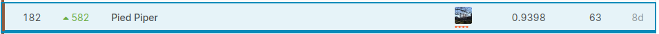

# SIIM-ISIC Melanoma Classification

This is the repository for the Kaggle competition: 

https://www.kaggle.com/c/siim-isic-melanoma-classification

I got 182th out of 3314 teams (top 6%)

Key:

- EfficientNet B3-6 on 384 to 768 image sizes
- Extend binary classification to multi-class classification
- Image augmentation + Test Time Augmentation (TTA)
- Ensemble
- Trust Local CV

